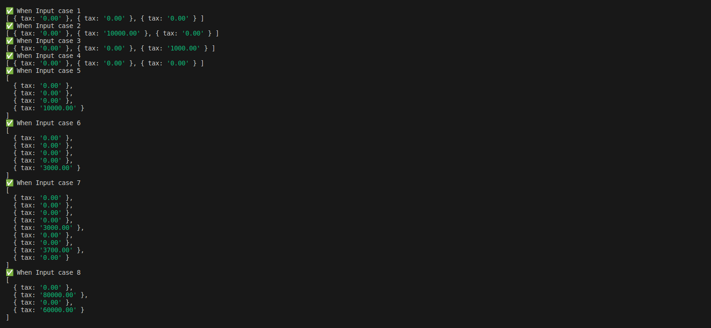

O projeto foi contruido em Javascript. 

Basta ter o Node.Js instalado para conseguir executar

## Caso 1

```bash

npm run start < operations/1.json

```

Resultado:

```bash

[ { tax: '0.00' }, { tax: '0.00' }, { tax: '0.00' } ]

```

## Caso 2

```bash

npm run start < operations/2.json

```

Resultado:

```bash

[ { tax: '0.00' }, { tax: '10000.00' }, { tax: '0.00' } ]

```

## Caso 3

```bash

npm run start < operations/3.json

```

Resultado:

```bash

[ { tax: '0.00' }, { tax: '0.00' }, { tax: '1000.00' } ]

```

## Caso 4

```bash

npm run start < operations/4.json

```

Resultado:

```bash

[ { tax: '0.00' }, { tax: '0.00' }, { tax: '0.00' } ]

```

## Caso 5

```bash

npm run start < operations/5.json

```

Resultado:

```bash

[
  { tax: '0.00' },
  { tax: '0.00' },
  { tax: '0.00' },
  { tax: '10000.00' }
]
```
## Caso 6

```bash

npm run start < operations/6.json

```

Resultado:

```bash

[
  { tax: '0.00' },
  { tax: '0.00' },
  { tax: '0.00' },
  { tax: '0.00' },
  { tax: '3000.00' }
]
```

## Caso 7

```bash

npm run start < operations/7.json

```

Resultado:

```bash
[
  { tax: '0.00' },
  { tax: '0.00' },
  { tax: '0.00' },
  { tax: '0.00' },
  { tax: '3000.00' },
  { tax: '0.00' },
  { tax: '0.00' },
  { tax: '3700.00' },
  { tax: '0.00' }
]
```

## Caso 8

```bash

npm run start < operations/8.json

```

Resultado:

```bash
[
  { tax: '0.00' },
  { tax: '80000.00' },
  { tax: '0.00' },
  { tax: '60000.00' }
]
```

# Testes Unitários

```bash

npm run tests

```

